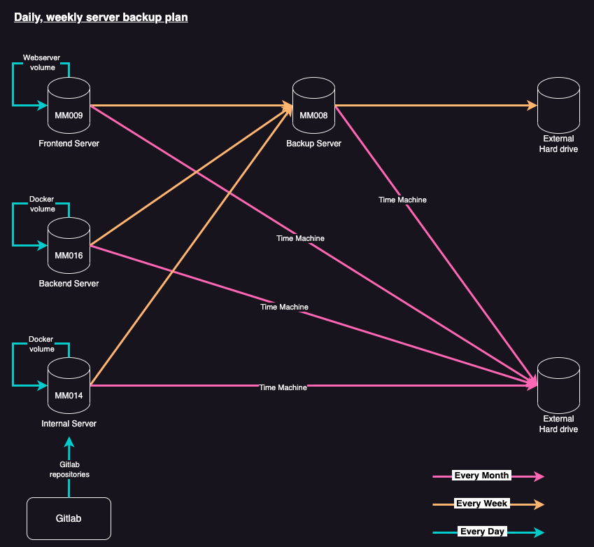

# Server Backup planning

# Why we need a back up

- Disaster Recovery

In the event of a disaster such as a hardware failure, cyber attack, or natural disaster, having a backup of your server can help you quickly restore your data and get your systems back up and running.

— Data Loss Prevention

Backing up your server helps prevent data loss due to accidental deletion or corruption of files. If your data is backed up regularly, you can easily restore any lost or corrupted files.

— Business Continuity

Backing up your server ensures that your business operations can continue even in the event of a server failure. This helps minimize downtime and ensures that critical business functions can continue without interruption.

— Peace of Mind

Knowing that your data is backed up can provide peace of mind and reduce stress. You can rest assured that your data is safe and can be easily restored if needed.

---

# Resources we need to back up

### Git Repository

- all coding is frontend member important resource

### Docker volumes

- Volumes are used to store data that needs to be shared between containers, or data that needs to persist even if the container is removed
- mysql database, jenkins home etc.

### Webserver volume

- the preview server file complied form jenkins project
- preview gi, gc

---

# Cycle

- every day (cron job at every night 2230)
    - zip all gitlab respositories and sync with local git repository
    - docker volume backup (e.g. mysql, jenkins)
    - web server volume (e.g. frontendTool, middleman)
- every week (cron job at every Friday 2330)
    - zip 7 days folder in backupVolume in MM009, MM014, MM016
    - send the zip to MM008 for storage
    - copy zip in MM008 to hard disk
- every month (at first day of each month)
    - time machine

